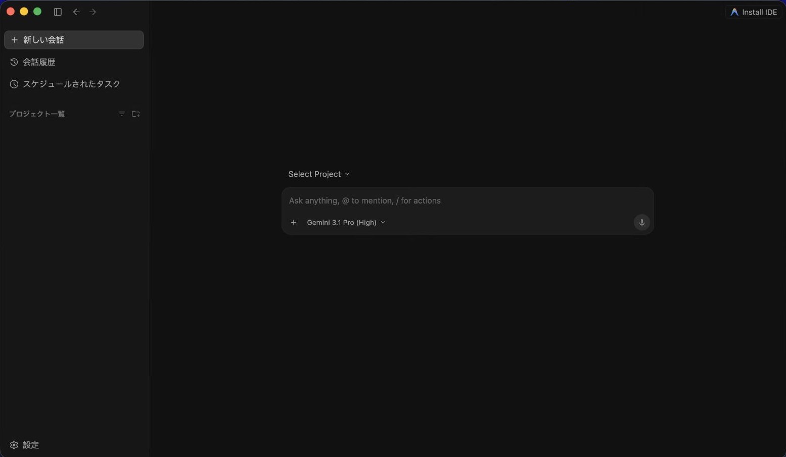
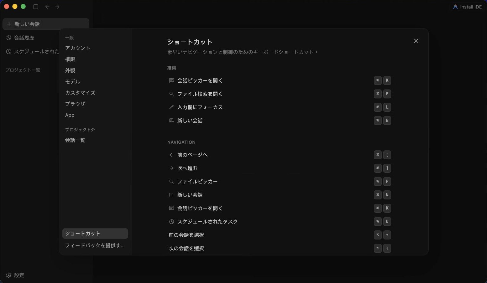

# Antigravity 2.0 日本語化パッケージ

Antigravity 2.0 のインターフェースを日本語に翻訳します。Windows と macOS をサポートし、Node.js と `npm install` の準備後にインストールスクリプトによる導入と復元ができます。

---

## はじめに

**Antigravity 2.0 日本語化パッケージ**は、オープンソースのインターフェースローカライズツールです。ASAR のアンパックと再パック機能を利用して、Antigravity 2.0 の英語インターフェースを日本語に翻訳します。

- 公式コアバイナリファイルを変更しません
- 公式 `app.asar` やその他の公式ファイルを配布しません
- インストールスクリプトによる導入と復元をサポート
- すべての操作はユーザーのローカルマシンで実行されます

---

## 使用イメージ

### メイン画面



### 設定画面



> 💡 **注意**: 画像ファイルが `images/` ディレクトリに配置されていない場合は、ご自身でスクリーンショットを撮影して配置してください。

---

## 主な機能

- 🌐 **日本語インターフェース**：メインUI、設定ページ、Agent 管理、MCP/ナレッジベースページなど複数の領域をカバー
- 🖥️ **クロスプラットフォーム対応**：Windows と macOS の両方をサポート
- 🔧 **スクリプトによる導入**：依存関係の準備後、インストールスクリプトを実行して日本語化を適用
- 🔄 **復元スクリプト**：必要に応じて公式英語版へ復元可能
- 🛡️ **安全なバックアップ**：初回インストール時に公式 `app.asar` を自動バックアップ
- 📦 **オフライン動作**：ローカルの `@electron/asar` を使用し、`npx` の動的ダウンロードに依存しません
- 🎯 **精確な翻訳**：コード領域、Terminal、エディタなど翻訳すべきでない領域を自動的にスキップ

---

## 重要：公式アプリ更新後は再インストールが必要です

> ⚠️ **Antigravity の公式アップデート後、日本語インターフェースが消える場合があります。これは正常な動作です。**

Antigravity の公式アップデート時に `app.asar` ファイルが上書きされ、以前に注入された日本語ローカライズ内容が削除されます。

**これは正常な動作であり、パッケージの不具合ではありません。**

アップデート後にインストールスクリプトを再実行するだけで、日本語インターフェースを復元できます：

- **Windows**：`install-win.bat` をダブルクリック
- **macOS**：`install-macos.command` をダブルクリック

> 💡 Antigravity のアップデート完了後に、インストールスクリプトを再実行する習慣をつけることをお勧めします。

---

## 対応状況

| プラットフォーム | インストール | 復元 | UI 検証 | 備考 |
|------|------|------|---------|------|
| macOS | ✅ 成功 | ✅ 成功 | ✅ 成功 | 手動インストールテスト成功 |
| Windows | ✅ 成功 | ✅ 成功 | ⚠️ 部分検証 | v1.0.1 は Windows 10 でテスト済み、Windows 11 は未検証 |

---

## 事前準備

本パッケージを使用する前に、以下のツールがインストールされていることを確認してください：

| 必要項目 | 説明 |
|----------|------|
| **Antigravity 2.0** | 本パッケージの翻訳対象。先に Antigravity をインストールする必要があります |
| **Node.js LTS** | [nodejs.org](https://nodejs.org/) からダウンロードしてインストール（npm も同時にインストールされます） |
| **npm** | Node.js と同時にインストールされ、ローカル依存パッケージのインストールに使用 |

### 初回使用前

プロジェクトルートディレクトリで一度実行してください：

```bash
npm install
```

このステップでローカルの `@electron/asar` パッケージがインストールされ、ASAR のアンパックと再パックに使用されます。本パッケージはローカルにインストールされた `@electron/asar` を使用し、`npx` の動的ダウンロードに依存しないため、オフライン環境でも正常に動作します。

---

## ダウンロード方法

### 方法1：GitHub Releases（推奨）

本プロジェクトの [GitHub Releases](../../releases) ページから、完全な `.zip` ファイルをダウンロードしてください。

1. `antigravity2-ja-jp-v1.0.1.zip` をダウンロード（バージョン番号は最新のものを選択してください）
2. 任意のディレクトリに解凍
3. 解凍したディレクトリで以下を実行：

```bash
npm install
```

> ⚠️ **注意**：完全な `.zip` ファイルをダウンロードしてください。`.bat` や `.command` ファイルだけをダウンロードしないでください。インストールスクリプトは `localization_engine.js`、`dicts/` 辞書ディレクトリ、`package.json` などのファイルが必要です。

> ⚠️ **注意**：Releases の zip には `node_modules/` が含まれていないため、解凍後に `npm install` を実行して依存パッケージをインストールする必要があります。

### 方法2：Git Clone

```bash
git clone https://github.com/<owner>/antigravity2-ja-jp.git
cd antigravity2-ja-jp
npm install
```

> `<owner>` を実際の GitHub アカウント名に置き換えてください。

---

## インストール方法

### Windows

#### 1. 前提条件の確認
**コマンドプロンプト**または **PowerShell** を開き、Node.js と npm が使用可能であることを確認します：
```cmd
node -v
npm -v
```

上記のコマンドがバージョン番号を正しく出力したら、プロジェクトディレクトリで以下を実行します：
```cmd
npm install
```

#### 2. 日本語化のインストール
1. Antigravity ソフトウェアを**完全に終了**します。
2. 本パッケージのフォルダ内で、**`install-win.bat` をダブルクリック**します。
3. 実行完了後、Antigravity を再起動すると、日本語インターフェースが表示されます。

#### 3. インストールパスの手動指定
Antigravity のインストール場所がデフォルトと異なる場合は、以下の方法で手動指定できます：
```cmd
node localization_engine.js --install-dir "C:\Users\<ユーザー名>\AppData\Local\Programs\antigravity"
```

### macOS

#### 1. 前提条件の確認
**Terminal** を開き、Node.js と npm が使用可能であることを確認します：
```bash
node -v
npm -v
```

上記のコマンドがバージョン番号を正しく出力したら、プロジェクトディレクトリで以下を実行します：
```bash
npm install
```

#### 2. 日本語化のインストール
1. Antigravity ソフトウェアを**完全に終了**します（メニューバー → Antigravity → Quit、または `Cmd+Q`）。
2. Finder で本パッケージのフォルダを開き、**`install-macos.command` をダブルクリック**します。
   - システムが「開発元を検証できません」と表示した場合は、Finder でファイルを右クリック → **開く** を選択してください。
3. 実行完了後、Antigravity を再起動すると、日本語インターフェースが表示されます。

#### 3. .command が実行できない場合
`.command` ファイルをダブルクリックしても反応がない場合は、Terminal で実行権限を付与してください：
```bash
chmod +x install-macos.command restore-macos.command
```

#### 4. インストールパスの手動指定
Antigravity のインストール場所がデフォルトと異なる場合は、以下の方法で手動指定できます：
```bash
node localization_engine.js --install-dir "/Applications/Antigravity.app"
```

#### 5. macOS EPERM/EACCES バックアップの説明
初回インストール時にエンジンが `app.asar.bak` バックアップファイルを作成します。一部の macOS 環境では権限の問題が発生する場合があります：
1. エンジンはまず `fs.copyFileSync` でバックアップを試みます
2. **EPERM** または **EACCES** エラーが発生した場合、自動的に `/bin/cp -p` にフォールバックします
3. 本パッケージは **`sudo` を自動的に実行しません**

フォールバックも失敗した場合は、手動でバックアップを作成してからインストールを実行してください：
```bash
cp "/Applications/Antigravity.app/Contents/Resources/app.asar" \
   "/Applications/Antigravity.app/Contents/Resources/app.asar.bak"
```

---

## 公式版へ戻す方法

### Windows
`restore-win.bat` をダブルクリックするか、コマンドラインで以下を実行します：
```cmd
node localization_engine.js --restore
```

### macOS
`restore-macos.command` をダブルクリックするか、Terminal で以下を実行します：
```bash
node localization_engine.js --restore
```

### 汎用方法
どのプラットフォームでも以下のコマンドで復元できます：
```bash
node localization_engine.js --restore
```

> 復元時、エンジンは初回インストール時に作成された `app.asar.bak` を使用して公式版を復元します。復元完了後、バックアップファイルは削除されます。

---

## 翻訳範囲

- `dicts/` ディレクトリ内の JSON 辞書に基づき、UI テキストを翻訳します。
- 現在、日本語翻訳は完了しています。
- Terminal のメッセージやコード領域など、翻訳すべきでない領域はスキップされます。

---

## プロジェクト構成

```
antigravity2-ja-jp/
├── README.md                 # 本ドキュメント
├── LICENSE                   # ライセンス
├── package.json              # 依存パッケージ管理
├── localization_engine.js    # 日本語化エンジンコア
├── install-win.bat           # Windows 用インストールスクリプト
├── restore-win.bat           # Windows 用復元スクリプト
├── install-macos.command     # macOS 用インストールスクリプト
├── restore-macos.command     # macOS 用復元スクリプト
├── dicts/                    # 翻訳辞書ディレクトリ
│   ├── main.json             # メインUI辞書
│   └── settings.json         # 設定画面辞書（例）
├── images/                   # スクリーンショットディレクトリ
└── scripts/                  # 開発用スクリプト
```

---

## FAQ

<details>
<summary><strong>なぜ npm install が必要ですか？</strong></summary>

本パッケージは `@electron/asar` を使用して ASAR のアンパックと再パックを行います。`npm install` によりこのツールがローカルの `node_modules/` ディレクトリにインストールされ、インストールスクリプトが正常に動作するようになります。初回使用時に一度だけ実行すれば十分です。
</details>

<details>
<summary><strong>Node.js なしで使用できますか？</strong></summary>

現時点ではできません。ローカライズエンジンは Node.js で作成されており、ASAR のアンパック、注入、再パックに Node.js が必要です。[nodejs.org](https://nodejs.org/) から LTS 版をインストールしてください。
</details>

<details>
<summary><strong>npx is not recognized が表示されたら？</strong></summary>

本パッケージはローカルの `@electron/asar` を使用しており、`npx` には依存していません。プロジェクトルートディレクトリで `npm install` を実行済みであることを確認してください。
</details>

<details>
<summary><strong>node.exe のアクセスが拒否されたら？</strong></summary>

この問題は通常 Windows で発生し、システム PATH 上の `node.exe` が異常な場所を指していることを意味します。既存の Node.js を削除し、[nodejs.org](https://nodejs.org/) から LTS 版を再ダウンロードしてインストールし、ターミナルを再起動して確認してください。
</details>

<details>
<summary><strong>Antigravity を更新した後、日本語化が消えた場合は？</strong></summary>

Antigravity の公式アップデート時に `app.asar` ファイルが上書きされ、以前に注入された日本語ローカライズ内容が削除されます。これは正常な動作であり、パッケージの不具合ではありません。

解決方法：

1. Antigravity を完全に終了
2. インストールスクリプトを再実行（Windows：`install-win.bat`、macOS：`install-macos.command`）
3. Antigravity を再起動すると、日本語インターフェースが復元されます
</details>

<details>
<summary><strong>公式版に復元する方法は？</strong></summary>

Windows は `restore-win.bat`、macOS は `restore-macos.command` を実行するか、`node localization_engine.js --restore` を使用してください。復元時に `app.asar.bak` を使用して公式版を復元します。
</details>

<details>
<summary><strong>公式 app.asar を変更しますか？</strong></summary>

はい、インストールプロセスで `app.asar` をアンパックし、翻訳コードを注入してから再パックします。ただし、初回インストール時に `app.asar.bak` バックアップが自動作成されるため、いつでも公式版に復元できます。
</details>

<details>
<summary><strong>公式 app.asar を配布しますか？</strong></summary>

いいえ。本プロジェクトは Antigravity 公式の `app.asar` やその他の公式バイナリファイルを含まず、配布しません。すべての操作はユーザーのローカルマシンで実行されます。
</details>

<details>
<summary><strong>インストールスクリプトの最後に Saving session などのメッセージが出ます</strong></summary>

`.command` 終了後に Terminal が `Saving session...` や `[プロセスが完了しました]` などのシステムメッセージを表示する場合があります。これは macOS / shell 側の表示であり、インストール結果には影響しません。本パッケージのエラーではありません。
</details>

---

## 注意事項

1. **操作前に Antigravity を終了してください**：インストールまたは復元スクリプトを実行する前に、Antigravity を完全に終了してください。ファイルが使用中の場合、エラーが発生する可能性があります。
2. **Antigravity 更新後は再適用が必要**：公式アップデートにより `app.asar` が上書きされます。更新後にインストールスクリプトを再実行してください。
3. **macOS Gatekeeper**：`.command` ファイルを初めて実行する際、「開発元を検証できません」と表示された場合は、Finder でファイルを右クリック → 開く を選択してください。
4. **Windows 権限**：「アクセスが拒否されました」と表示された場合は、`.bat` ファイルを右クリック → **管理者として実行** してください。
5. **sudo で実行しないでください**：本パッケージは `sudo` を自動的に使用しません。root 権限でスクリプトを実行することもお勧めしません。

---

## ライセンス

本プロジェクトは [Apache License 2.0](LICENSE) の下で公開されています。

---

## 免責事項

- 本プロジェクトは非公式のコミュニティツールであり、Antigravity 公式とは無関係です。
- 本プロジェクトは Antigravity 公式の `app.asar` やその他の公式バイナリファイルを**含まず、配布しません**。
- ユーザーは、ローカルアプリケーションリソースの変更に伴うリスクを自己責任で負うものとします。
- すべての注入操作はユーザーのローカルマシンで実行され、完全な復元機能が提供されます。
- 本プロジェクトは Apache License 2.0 に基づき「現状のまま」（AS IS）で提供され、明示的または暗黙的な保証は一切ありません。
